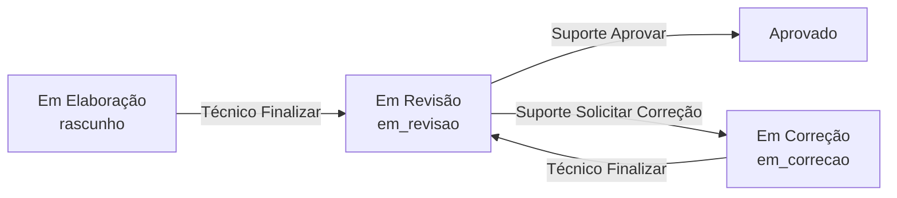

# Ticket #246 — Devolver ao Técnico / Solicitar Correção

**Tipo:** Melhoria  
**Data da análise:** 2026-05-19  
**Revisão:** 2026-05-19 — decisões de produto confirmadas  

---

## Resumo executivo

O Suporte precisa **devolver o relatório ao técnico** autor, com **descrição da correção**, status **“Em Correção”** (`em_correcao`), **histórico** de solicitações e **totalizador no Dashboard**.

**Situação atual:** no #275 existe **“Reprovar”** → `rascunho` sem descrição/histórico — **deve ser removido** e substituído por este fluxo. **Aprovar** permanece.

**Decisões fechadas:** novo status `em_correcao`; botão “Solicitar Correção”; descrição obrigatória (mín. 10 chars); sem migração de legado (pré-produção).

**Veredito:** **Implementado** (2026-05-19) — fluxo Solicitar Correção com status `em_correcao`.

---

## 1. Entendimento e contexto

### Dor do usuário

Em **Em Revisão**, o Suporte identifica erros e devolve o documento ao técnico, registrando **o que corrigir** e mantendo **rastreabilidade** (histórico + totalizador no dashboard; relatórios analíticos ficam para fase posterior).

### Resultado esperado (prompt)

| # | Requisito | Decisão |
|---|-----------|---------|
| 1 | Botão **“Solicitar Correção”** | ✅ Confirmado (substitui Reprovar) |
| 2 | Campo **descrição** | ✅ Obrigatório, mín. 10 caracteres |
| 3 | Status **“Em Correção”** | ✅ Novo: `em_correcao` |
| 4 | **Aba histórico** | ✅ Somente leitura; visível a quem acessa o documento |
| 5 | Dashboard **“Em Correção”** | ✅ Totalizador (sem módulo de estatísticas agora) |

### Fluxo fechado



---

## 2. Rastreabilidade de código

### Banco de dados

| Objeto | Ação |
|--------|------|
| `reports.status` | Aceitar `em_correcao` |
| **`relatorios_correcoes`** (nova) | Histórico: report_id, solicitado_por_id, descricao, status_anterior/novo, created_at |

**Migration:** `migration_019_em_correcao_historico.sql`

Railway: `reports.status` VARCHAR sem CHECK — inclusão direta.

### Backend

| Arquivo | Ação |
|---------|------|
| `models/report_correcao.py` | Novo model |
| `core/report_permissions.py` | `em_correcao`; remover `em_revisao`→`rascunho`; Técnico finaliza `em_correcao`→`em_revisao` |
| `api/v1/reports.py` | `POST /solicitar-correcao`, `GET /correcoes` |
| `schemas/report.py` | Incluir `em_correcao` no pattern |

### Frontend

| Arquivo | Ação |
|---------|------|
| `ReportWizardPage.tsx` | Modal + aba histórico; remover Reprovar |
| `reportPermissions.ts` | `canRequestCorrection`, `canFinalize` em `em_correcao` |
| `statusLabels.ts` | `em_correcao: 'Em Correção'` |
| `DashboardPage.tsx` | Card Em Correção (Técnico: só os seus; Suporte: todos) |
| `ReportListPage.tsx` | Filtro + badge |
| `lib/api/reports.ts` | `requestCorrection`, `listCorrecoes` |

---

## 3. Matriz de permissões (fechada)

| Status | Técnico (autor) | Suporte | Admin |
|--------|-----------------|---------|-------|
| `rascunho` | Editar + Finalizar + Excluir | **Não ver** (#275) | Visualizar |
| `em_revisao` | Visualizar | Editar + Aprovar + **Solicitar Correção** | Visualizar |
| `em_correcao` | **Editar + Finalizar** (→ revisão) | Ver listagem/dashboard; **não editar** | Visualizar |
| `aprovado` / `cancelado` | Visualizar (se autor) | Conforme #275 | Visualizar |

**Histórico de correções:** qualquer usuário com **`canViewReport`** no relatório (Técnico autor, Suporte, Admin) — aba **somente leitura**.

**Export Excel (Suporte):** mantém #275 — apenas `em_revisao` e `aprovado`, **não** `em_correcao`.

---

## 4. Decisões de produto (checklist — confirmado)

| # | Pergunta | Decisão |
|---|----------|---------|
| 1 | “Em Correção” = novo status ou `rascunho`? | **`em_correcao`** (novo status) |
| 2 | Substituir “Reprovar” (#275)? | **Sim** → “Solicitar Correção” |
| 3 | Descrição obrigatória? | **Sim**, mínimo **10 caracteres** |
| 4 | Técnico vê card no dashboard? | **Sim**, **somente os seus** |
| 5 | Suporte vê na listagem? | **Sim**, acompanhamento; **sem editar** |
| 6 | Após corrigir, técnico usa? | **Mesmo botão Finalizar** → `em_revisao` |
| 7 | Quem vê o histórico? | **Todos com acesso ao documento** (`canViewReport`) |
| 8 | Aba histórico editável? | **Não** — somente leitura |
| 9 | Estatísticas / relatórios analíticos | **Fora de escopo agora** — só totalizador no dashboard; tabela `relatorios_correcoes` prepara dados futuros |
| 10 | Legado Reprovar→`rascunho` | **Remover** transição; **sem migração** (pré-produção) |

---

## 5. Análise de impacto e regressão

### Delta #275 → #246

| Item | Remover | Adicionar |
|------|---------|-----------|
| UI | Botão **Reprovar** | **Solicitar Correção** + modal |
| Status | `em_revisao` → `rascunho` | `em_revisao` → `em_correcao` |
| Dados | — | Tabela + aba histórico |
| Dashboard | — | Card **Em Correção** |

### Re-teste

- Solicitar Correção (Suporte, em revisão, descrição &lt; 10 → erro)
- Técnico edita e Finaliza a partir de `em_correcao`
- Dashboard: Técnico conta só os seus; Suporte vê total geral em correção
- Listagem Suporte inclui `em_correcao`; Técnico vê os seus
- Aprovar (#275) inalterado
- Permissões #244 / #275 nos demais status

---

## 6. Sugestão de implementação

### Fase 1 — `migration_019_em_correcao_historico.sql`

- `CREATE TABLE relatorios_correcoes` (conforme seção 2)
- Sem script de migração de dados legado

### Fase 2 — Backend

```python
POST /reports/{id}/solicitar-correcao
  body: { descricao: str }  # min 10, max 2000
  regras: suporte_puro + status == em_revisao
  efeito: insert histórico + status = em_correcao

GET /reports/{id}/correcoes
  regras: can_view_report
  retorno: lista DESC por created_at (autor, data, descricao)
```

`can_update_report_status`:
- Suporte: `em_revisao` → `aprovado` (Aprovar); **`em_correcao` só via POST dedicado**
- Técnico: `rascunho`|`em_correcao` → `em_revisao` (Finalizar, próprio)
- **Remover:** `em_revisao` → `rascunho`

### Fase 3 — Frontend

1. `statusLabels` + tipos TS/API com `em_correcao`
2. Modal **Solicitar Correção** (textarea, validação 10+ chars)
3. Aba **Histórico de Correções** (read-only)
4. `canFinalizeReport`: true para Técnico em `rascunho` **e** `em_correcao`
5. Dashboard: card **Em Correção** (+ ajuste grid 6 cards ou layout responsivo)
6. Remover `canRejectReport` / botão Reprovar

### Fase 4 — Docs

- Atualizar `tickets/275`, `fluxo-permissoes-relatorio.md`

**Estimativa:** 1,5–2 dias.

---

## 7. Critérios de aceite

- [x] **Solicitar Correção** substitui Reprovar (Suporte, `em_revisao`).
- [x] Descrição obrigatória (≥ 10 chars); grava em `relatorios_correcoes`.
- [x] Status passa para **`em_correcao`** (“Em Correção”).
- [x] Aba histórico read-only para quem tem `canViewReport`.
- [x] Técnico autor edita em `em_correcao` e **Finaliza** → `em_revisao`.
- [x] Dashboard: totalizador **Em Correção** (Técnico: só os seus; Suporte: todos).
- [x] Listagem: Suporte vê `em_correcao`; filtro disponível.
- [x] Transição `em_revisao` → `rascunho` **removida** (API + UI).
- [x] **Aprovar** continua operante.

---

## 8. Veredito de prontidão

| Critério | Status |
|----------|--------|
| Requisitos do prompt | ✅ |
| Decisões de produto (seção 4) | ✅ **Todas confirmadas** |
| Gap vs #275 documentado | ✅ |
| Migração legado | ✅ N/A (pré-produção) |
| **Pronto para desenvolvimento** | **Implementado** |

---

## Anexo — Código a alterar do #275

| Hoje | Ação #246 |
|------|-----------|
| `canRejectReport` / Reprovar → `rascunho` | **Remover** → `canRequestCorrection` |
| `canFinalizeReport` só `rascunho` | Incluir **`em_correcao`** |
| `can_update_report_status`: `rascunho` no reprovar | **Remover**; usar POST dedicado |
| Botões Aprovar + Reprovar | Aprovar + **Solicitar Correção** |
