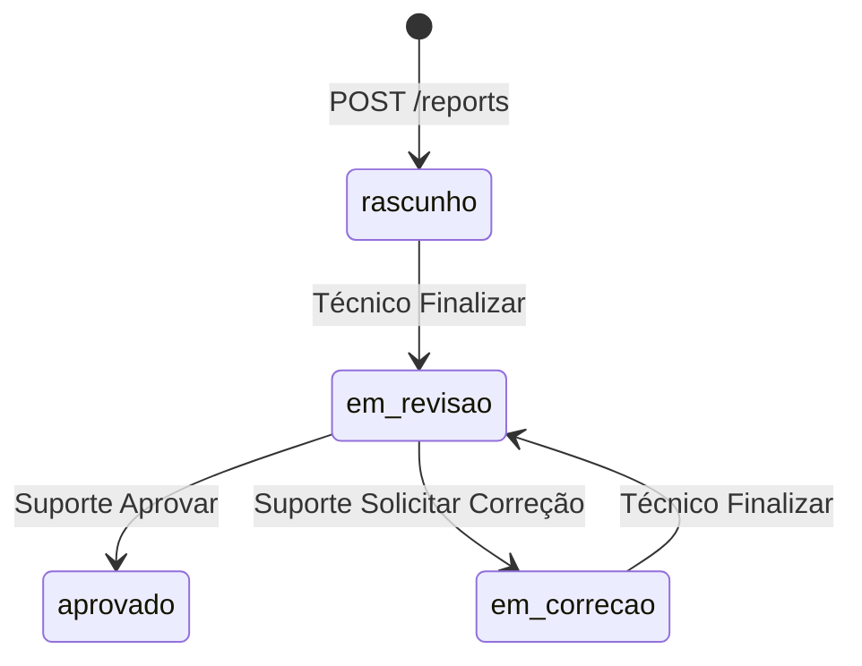

# Ticket #248 — Ativar envio de e-mail a cada avanço do fluxo

**Tipo:** Infra  
**Data da análise:** 2026-06-11  
**Status:** Pronto para desenvolvimento (com esclarecimentos pendentes)  
**Referência:** Prompt RRVM / setup SMTP `ser@rrvm.com.br` @ `mail.rrvm.com.br:465`

---

## Resumo executivo

O SER possui **fluxo de status de relatórios** (rascunho → revisão → correção → aprovado), mas **não envia e-mail** em nenhuma transição. A demanda é disparar **e-mail HTML elegante** a cada avanço relevante do documento, informando o que ocorreu e o que o próximo atuante deve fazer, para **todos os envolvidos**.

Também exige **parametrização SMTP na tela Configurações** ([`/configuracoes`](https://laudonr13-frontend-prod.up.railway.app/configuracoes)) e **botão de teste** (escolher relatório, ação simulada e destinatário único).

**Situação atual:** zero implementação de SMTP (apenas exemplo `smtp_host` no schema de configuração e `email-validator` no Pydantic). Password reset devolve token na API, sem envio real.

**Veredito:** **Sim — pronto para desenvolvimento**, após confirmar lista exata de destinatários por evento, identidade visual do e-mail e política de falha (bloquear fluxo vs. logar e seguir).

---

## 1. Entendimento e contexto

### Dor do usuário

Usuários (Técnico, Suporte/Revisor) não são notificados quando um relatório muda de etapa. Dependem de acessar o dashboard manualmente, o que atrasa revisão, correção e aprovação.

### Setup SMTP informado (RRVM)

| Parâmetro | Valor |
|-----------|--------|
| Servidor | `mail.rrvm.com.br` |
| Porta | `465` (SMTPS / SSL) |
| Remetente | `ser@rrvm.com.br` |
| Senha | Fornecida pela RRVM — **configurar só via UI/env; nunca no código ou Git** |

### Onde encaixa no sistema

| Camada | Hoje | Após #248 |
|--------|------|-----------|
| Transições de status | `reports.py` — commit sem side effects | + hook de notificação pós-commit |
| Config SMTP | Inexistente | Painel em Configurações (padrão `nr13_integracao`) |
| Templates | Inexistentes | HTML por tipo de evento |
| Teste | Inexistente | `POST /configuracoes/email/test` + UI admin |

---

## 2. Fluxo de relatórios (eventos que disparam e-mail)

### Status válidos

| Código | Label UI |
|--------|----------|
| `rascunho` | Em Elaboração |
| `em_revisao` | Em Revisão |
| `em_correcao` | Em Correção |
| `aprovado` | Aprovado |
| `cancelado` | Cancelado (sem transição API hoje) |

### Máquina de estados (implementada)



### Eventos candidatos a e-mail

| # | Evento | Endpoint | Transição | Ator | Destinatários sugeridos |
|---|--------|----------|-----------|------|-------------------------|
| E1 | **Finalizar** | `PUT /reports/{id}/status` → `em_revisao` | `rascunho`\|`em_correcao` → `em_revisao` | Técnico (dono) | **Suporte/Revisor** (todos ativos com e-mail) |
| E2 | **Solicitar correção** | `POST /reports/{id}/solicitar-correcao` | `em_revisao` → `em_correcao` | Suporte | **Técnico** (`report.tecnico_id`) + opcional solicitante |
| E3 | **Aprovar** | `PUT /reports/{id}/status` → `aprovado` | `em_revisao` → `aprovado` | Suporte | **Técnico** + opcional Suporte envolvido |
| E4 | Criar relatório | `POST /reports` | → `rascunho` | Técnico | **Opcional** — ticket não exige explicitamente |
| E5 | Cancelar | — | — | — | **Fora de escopo** até existir API |

**Próxima ação no e-mail (conteúdo):**

| Evento | Mensagem orientativa |
|--------|----------------------|
| E1 Finalizar | “Relatório {numero} aguarda sua revisão. Acesse o SER e analise o documento.” |
| E2 Correção | “Correções solicitadas: {descricao}. Ajuste o relatório e finalize novamente.” |
| E3 Aprovado | “Relatório {numero} aprovado. Disponível para exportação PDF.” |

### Dados disponíveis para template

De `_report_to_response` / `ReportResponse`:

- `numero`, `status`, `tipo_inspecao`, `data_inspecao`, `observacoes`
- `cliente` (nome, CNPJ), `equipamento` (TAG, nome)
- `tecnico` (nome, email)
- Link deep: `{FRONTEND_URL}/relatorios/{id}/preencher` ou dashboard

Histórico de correção: `ReportCorrecao.descricao`, `solicitado_por` (E2).

---

## 3. Impacto técnico

### Arquivos backend (criar/alterar)

| Arquivo | Ação |
|---------|------|
| `src/services/email_config.py` | **Novo** — chave DB `email_integracao`, merge env, máscara senha (espelhar `nr13_config.py`) |
| `src/services/email_service.py` | **Novo** — SMTP SSL 465, render template, envio |
| `src/templates/email/` | **Novo** — HTML base + partials por evento |
| `src/schemas/email_config.py` | **Novo** — GET/PUT/test schemas |
| `src/api/v1/configuracoes.py` | Rotas `GET/PUT /email-integracao`, `POST /email-integracao/test` |
| `src/api/v1/reports.py` | Hooks após commit em `update_report_status`, `solicitar_correcao` |
| `src/core/config.py` | Vars opcionais `SMTP_*`, `FRONTEND_URL` |
| `requirements.txt` | `aiosmtplib` (ou stdlib `smtplib` sync em thread) |

### Arquivos frontend (criar/alterar)

| Arquivo | Ação |
|---------|------|
| `src/app/components/EmailIntegracaoPanel.tsx` | **Novo** — host, porta, user, senha, from, enabled |
| `src/app/components/EmailTestPanel.tsx` | **Novo** — select relatório, ação, destinatário teste |
| `src/app/routes/ConfiguracoesPage.tsx` | Incluir painéis; ocultar chave `email_integracao` da tabela genérica |
| `src/lib/api/configuracoes.ts` | Métodos API e-mail |

### Tabelas

| Tabela | Uso |
|--------|-----|
| `configuracoes` | JSON `email_integracao` |
| `users` | `email` dos destinatários |
| `reports` | Contexto do relatório |
| `relatorios_correcoes` | Texto da correção (E2) |
| *(opcional v2)* `email_log` | Auditoria de envios |

### Código reutilizável

- Padrão config: `nr13_config.py`, `Nr13IntegracaoPanel.tsx`, `POST .../test`
- Permissões: `report_permissions.py`
- Labels status: `frontend/src/lib/reports/statusLabels.ts`

---

## 4. Configuração SMTP (proposta)

### JSON em `configuracoes` (chave `email_integracao`)

```json
{
  "enabled": true,
  "smtp_host": "mail.rrvm.com.br",
  "smtp_port": 465,
  "smtp_use_ssl": true,
  "smtp_user": "ser@rrvm.com.br",
  "smtp_password": "***",
  "from_email": "ser@rrvm.com.br",
  "from_name": "SER - Sistema de Emissão de Relatórios",
  "frontend_base_url": "https://laudonr13-frontend-prod.up.railway.app"
}
```

### Variáveis de ambiente (fallback Railway)

```
SMTP_HOST=mail.rrvm.com.br
SMTP_PORT=465
SMTP_USER=ser@rrvm.com.br
SMTP_PASSWORD=***
SMTP_FROM=ser@rrvm.com.br
FRONTEND_URL=https://laudonr13-frontend-prod.up.railway.app
```

### Endpoints admin

| Método | Rota | Descrição |
|--------|------|-----------|
| GET | `/api/v1/configuracoes/email-integracao` | Lê config (senha mascarada) |
| PUT | `/api/v1/configuracoes/email-integracao` | Salva config |
| POST | `/api/v1/configuracoes/email-integracao/test` | Teste controlado |

**Body do teste:**

```json
{
  "report_id": 123,
  "evento": "finalizar",
  "destinatario_teste": "dev@example.com"
}
```

`evento`: `finalizar` | `solicitar_correcao` | `aprovar`  
Renderiza template com dados reais do relatório; envia **somente** para `destinatario_teste`.

---

## 5. Resolução de destinatários

| Perfil | Query sugerida |
|--------|----------------|
| Técnico | `User` por `report.tecnico_id`, `is_active`, `email IS NOT NULL` |
| Suporte/Revisor | `User` join `Role` where `name IN ('suporte','revisor',...)` OR `level BETWEEN 50 AND 99`, ativos |
| “Todos envolvidos” | União sem duplicatas: destinatários do evento + ator que disparou (opcional) |

**Gap:** não existe helper `get_users_by_role()` — criar em `email_service.py` ou `user_queries.py`.

**Usuários sem e-mail:** pular e logar warning; não falhar transição de status (recomendado).

---

## 6. Lacunas e checklist de esclarecimento

| # | Pergunta | Impacto | Recomendação |
|---|----------|---------|--------------|
| 1 | E-mail em **criação** de relatório (`rascunho`)? | Escopo | **Não** na v1 — só transições E1–E3 |
| 2 | Suporte recebe cópia em **aprovação**? | Destinatários | Sim — todos Suporte ativos + Técnico |
| 3 | Falha SMTP bloqueia mudança de status? | UX | **Não** — commit OK, log erro, opcional banner admin |
| 4 | Envio síncrono vs fila | Performance | v1 síncrono pós-commit; v2 Celery/RQ se lento |
| 5 | Identidade visual (logo RRVM, cores) | Template | Confirmar PNG/logo e paleta (#56991f SER?) |
| 6 | Assunto do e-mail por evento | Template | Ex.: `[SER] Relatório REL-2026-000001 — Aguardando revisão` |
| 7 | `cancelado` no fluxo | Eventos | Fora de escopo até haver API |
| 8 | Railway egress porta 465 | Deploy | Validar conectividade `mail.rrvm.com.br:465` |
| 9 | BCC administrativo | Auditoria | Opcional `bcc_admin@rrvm.com.br` em config |
| 10 | Idioma | Template | PT-BR |

---

## 7. Segurança

| Item | Avaliação |
|------|-----------|
| Senha SMTP | DB criptografado ou env; máscara `********` na UI; **nunca** no repositório |
| Teste de e-mail | Somente admin; destinatário explícito; nunca lista real de Suporte |
| Credenciais no prompt | Rotacionar se expostas; configurar via Configurações pós-deploy |
| HTML injection | Escapar `descricao` de correção no template |
| Rate limit teste | 1 req/30s por admin (opcional) |

---

## 8. Sugestão de implementação (fases)

### Fase 1 — Infra SMTP (~4h)

1. `email_config.py` + schemas + rotas GET/PUT em `configuracoes.py`
2. `EmailIntegracaoPanel.tsx` na página Configurações
3. Envio SMTP SSL (`mail.rrvm.com.br:465`)

### Fase 2 — Templates (~3h)

1. Layout HTML responsivo (header, corpo, botão CTA, rodapé)
2. Três variantes: `finalizar`, `solicitar_correcao`, `aprovar`
3. Função `build_report_email_context(report, event, actor, extra)`

### Fase 3 — Hooks de fluxo (~3h)

1. `notify_report_event(session, report, event, actor, **kwargs)` chamado após commit
2. Integrar em `update_report_status` e `solicitar_correcao`
3. Resolver destinatários; deduplicar e-mails

### Fase 4 — Teste admin (~2h)

1. `POST /email-integracao/test` + UI (select relatório, evento, e-mail teste)
2. Listagem de relatórios recentes para o combo (`GET /reports?page_size=20`)

**Estimativa total:** ~12h (1,5–2 dias).

---

## 9. Critérios de aceite

- [ ] SMTP configurável em **Configurações** (host, porta, usuário, senha, remetente, enabled).
- [ ] Senha mascarada na UI; persistência sem expor valor real na API GET.
- [ ] **Finalizar** → e-mail para Suporte/Revisor ativos com link e instrução de revisão.
- [ ] **Solicitar correção** → e-mail ao Técnico com descrição da correção.
- [ ] **Aprovar** → e-mail ao Técnico confirmando aprovação.
- [ ] E-mails HTML legíveis (desktop + mobile básico).
- [ ] Botão **Testar e-mail**: escolher relatório, evento e destinatário único; não envia para usuários reais do fluxo.
- [ ] Falha de SMTP **não reverte** mudança de status do relatório.
- [ ] Credenciais RRVM **não** commitadas no Git.

### Testes de regressão

- Matriz de permissões #275 inalterada (status, editar, export PDF).
- Password reset continua funcionando (sem regressão na API).
- Configurações NR13 e demais painéis intactos.

---

## 10. Veredito de prontidão

| Critério | Status |
|----------|--------|
| Fluxo de status mapeado | ✅ |
| Pontos de hook identificados | ✅ |
| Padrão de config existente (NR13) | ✅ |
| SMTP / templates | ❌ a implementar |
| Lacunas de negócio | ⚠️ 10 itens — confirmar destinatários e visual |
| **Pronto para dev?** | **Sim**, após OK em destinatários E1–E3 e logo/cores |

---

## Referências no código

| Item | Caminho |
|------|---------|
| API relatórios | `backend/src/api/v1/reports.py` |
| Permissões | `backend/src/core/report_permissions.py` |
| Config NR13 (modelo) | `backend/src/services/nr13_config.py` |
| Configurações UI | `frontend/src/app/routes/ConfiguracoesPage.tsx` |
| Wizard (ações) | `frontend/src/app/routes/ReportWizardPage.tsx` |
| Ticket permissões | `tickets/275/ticket-275-espec.md` |
| Correção #246 | `backend/src/models/report_correcao.py` |
