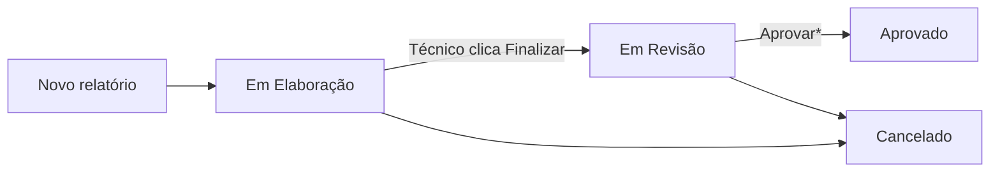

# Fluxo de relatórios — O que cada usuário pode fazer

Documento simples para apoiar a decisão do **Ticket #268** (bloquear edição após envio).

**Perfis considerados:** Técnico · Suporte · Administrador  

**Status no sistema (nome na tela):**

| Código no banco | Nome na tela        |
|-----------------|---------------------|
| `rascunho`      | Em Elaboração       |
| `em_revisao`    | Em Revisão          |
| `aprovado`      | Aprovado            |
| `cancelado`     | Cancelado           |

---

## Fluxo geral do documento

\* Hoje **não existe botão “Aprovar”** na tela do formulário; a mudança para Aprovado só pode ser feita pela API ou por outra ferramenta (lacuna de produto).

---

## Legenda das ações

| Símbolo | Significado |
|---------|-------------|
| ✅ | Pode fazer |
| 👁️ | Só visualizar (abrir e ver, sem alterar dados) |
| ❌ | Não pode |
| ⚠️ | Pode hoje, mas **não deveria** (bug / regra faltando) |

---

# PARTE 1 — Como está HOJE (antes do #268)

## Técnico

| Situação do relatório | Ver na lista | Abrir formulário | Alterar campos | Salvar / auto-save | Finalizar (enviar p/ revisão) | Excluir | Exportar Excel |
|----------------------|--------------|------------------|----------------|--------------------|------------------------------|---------|----------------|
| Em Elaboração (seu)  | ✅ só os seus | ✅ | ✅ | ✅ (auto-save ao digitar) | ✅ | ✅ | ❌ |
| Em Revisão (seu)     | ✅ | ✅ | ⚠️ **ainda altera** | ⚠️ **ainda grava** | ❌ | ❌ | ❌ |
| Aprovado (seu)       | ✅ | ✅ | ❌ (API bloqueia) | ❌ | ❌ | ❌ | ❌ |
| Cancelado (seu)      | ✅ | ✅ | ❌ | ❌ | ❌ | ❌ | ❌ |

**Problema reportado:** depois de **Finalizar**, o Técnico ainda clica no lápis e consegue mudar dados — isso está marcado como ⚠️.

---

## Suporte

| Situação do relatório | Ver na lista | Abrir formulário | Alterar campos | Botão “Salvar Rascunho” | Finalizar | Excluir | Exportar Excel |
|----------------------|--------------|------------------|----------------|-------------------------|-----------|---------|----------------|
| Em Elaboração (qualquer técnico) | ✅ todos | ✅ | ✅ | ✅ | ✅* | ✅ | ✅ |
| Em Revisão | ✅ | ✅ | ✅ | ❌ (botão não aparece) | ❌ | ✅ | ✅ |
| Aprovado | ✅ | ✅ | ❌ (API bloqueia) | ❌ | ❌ | ❌ | ✅ |
| Cancelado | ✅ | ✅ | ❌ | ❌ | ❌ | ✅ | conforme regra export |

\* O botão **Finalizar** na tela só aparece em **Em Elaboração**; Suporte pode abrir relatório de outro técnico ainda em elaboração e, na prática, **editar** (e o auto-save grava).

**Relato Paulo:** Suporte também consegue alterar informações — em **Em Revisão** isso é **permitido pelo sistema hoje** (papel de revisor). Se a expectativa for que **ninguém** edite após “envio”, a regra de negócio precisa ser refinada (ver Parte 3).

---

## Administrador

| Situação | Ver | Editar campos | Mudar status (API) | Excluir | Exportar Excel |
|----------|-----|---------------|-------------------|---------|----------------|
| Em Elaboração | ✅ todos | ✅ | ✅ | ✅ | ✅ |
| Em Revisão | ✅ | ✅ | ✅ | ✅ | ✅ |
| Aprovado | ✅ | ❌ (API bloqueia edição) | ✅ | ❌ | ✅ |
| Cancelado | ✅ | ❌ | ✅ | ✅ | conforme regra |

Administrador tem visão e controle amplos; edição de campos segue a mesma regra de API que Suporte (`rascunho` e `em_revisao`).

---

# PARTE 2 — Como ficaria DEPOIS do #268 (proposta)

**Ideia central:** quem **enviou** para a etapa seguinte **não edita mais**; quem **é responsável pela etapa atual** edita.

## Técnico (autor do relatório)

| Situação do relatório | Abrir | Alterar campos | Finalizar | Excluir |
|----------------------|-------|----------------|-----------|---------|
| Em Elaboração (seu)  | ✅ Editar | ✅ | ✅ | ✅ |
| Em Revisão (seu)     | 👁️ **Visualizar** | ❌ | ❌ | ❌ |
| Aprovado (seu)       | 👁️ Visualizar | ❌ | ❌ | ❌ |
| Cancelado (seu)      | 👁️ Visualizar | ❌ | ❌ | ❌ |

Na listagem: ícone de **lápis** só em Em Elaboração; em Revisão/Aprovado → **olho** ou texto **Visualizar**.

---

## Suporte (revisor da etapa “Em Revisão”)

| Situação do relatório | Abrir | Alterar campos | Aprovar* | Excluir | Exportar Excel |
|----------------------|-------|----------------|----------|---------|----------------|
| Em Elaboração        | ✅ (pode ajudar / corrigir antes do envio) | ✅ | ❌** | ✅ | ✅ |
| Em Revisão           | ✅ **Editar** (revisar) | ✅ | (API) | ✅ | ✅ |
| Aprovado             | 👁️ Visualizar | ❌ | ❌ | ❌ | ✅ |
| Cancelado            | 👁️ Visualizar | ❌ | ❌ | ✅ | conforme regra |

** Não muda com #268 se negócio confirmar: **Suporte continua podendo editar em Em Revisão** (é o responsável por essa etapa).

\** Finalizar na tela continua sendo ação do fluxo “elaboração → revisão”; em geral o Técnico finaliza.

---

## Administrador

Mesma lógica do Suporte para edição de campos, com poderes extras de configuração do sistema (formulários, usuários, etc.) — **inalterado** pelo #268.

| Situação | Editar campos |
|----------|---------------|
| Em Elaboração | ✅ |
| Em Revisão | ✅ |
| Aprovado | ❌ (somente leitura) |

---

# PARTE 3 — O que muda e o que NÃO muda

## Com o #268 implementado

| Item | Muda? |
|------|-------|
| Técnico editar após Finalizar | **Sim** — passa a só visualizar |
| Suporte editar em Em Revisão | **Não** — continua podendo (revisor) |
| Nomes dos status (Em Elaboração / Em Revisão) | **Não** — já definido no #252 |
| Botão Aprovar na tela | **Não** — fora deste ticket |
| Quem cria relatório | **Não** — continua sendo o usuário logado (técnico) |
| Valores no banco (`rascunho`, `em_revisao`) | **Não** — só bloqueio de edição |

## Pergunta para alinhar com Paulo / negócio

> **Suporte deve poder editar campos quando o relatório está “Em Revisão”?**

| Resposta | Efeito |
|----------|--------|
| **Sim** (recomendado na especificação técnica) | #268 corrige **só o Técnico** após enviar; Suporte segue editando em revisão |
| **Não** | Seria outra regra: **ninguém** edita após envio até nova etapa — impacta Suporte também |

---

# Resumo em uma frase por perfil

| Perfil | Hoje (problema) | Depois do #268 (proposta) |
|--------|-----------------|---------------------------|
| **Técnico** | Após enviar, ainda edita ⚠️ | Após enviar, **só vê** 👁️ |
| **Suporte** | Edita em revisão (e também em outros status conforme API) | **Continua editando em revisão** ✅ |
| **Administrador** | Edita em elaboração e revisão | Igual Suporte + configs |

---

# Onde isso é aplicado no sistema (referência rápida)

- Lista de relatórios (`/relatorios`) — ícone lápis  
- Formulário (`/relatorios/:id/preencher`) — campos e auto-save  
- API `PUT /reports/{id}` — gravação das respostas (backend deve bloquear também)  

---

*Documento gerado para apoio à aprovação do Ticket #268. Especificação técnica completa: `ticket-268-espec.md`.*
