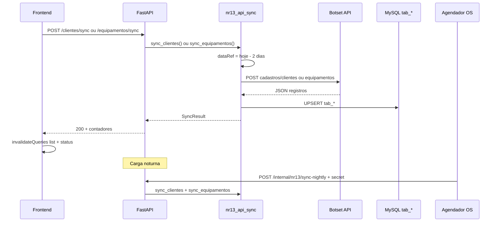

# Ticket #292 — Integração com sistema NR13 (API Botset) para carga de Clientes e Equipamentos

**Tipo:** Melhoria  
**Data da análise:** 2026-06-10  
**Status:** ✅ Implementado (2026-06-10)  

---

## Resumo executivo

O SER hoje exibe clientes e equipamentos a partir de **réplicas locais** (`tab_clientes`, `tab_equipamentos`), alimentadas manualmente pelo script `transfer_sqlserver_to_mysql.py` (SQL Server → MySQL). A demanda substitui/complementa essa origem por **API HTTP externa** (Botset BPM), com:

1. Botão na listagem de **Clientes** para disparar carga.
2. Botão na listagem de **Equipamentos** para disparar carga.
3. Parâmetro `dataRef` = **data atual − 2 dias** (registros incluídos ou alterados desde essa data).
4. Endpoint **interno** para agendamento de carga noturna (cron/Task Scheduler).

O frontend já possui stub `manutApi.triggerSync()` (`POST /manut/sync`), mas **o backend não implementa** essa rota. Existe serviço legado `sqlserver_sync.py.PENDENTE` (desatualizado) e padrão HTTP reutilizável em `lookup_lists.py` (`httpx`).

**Veredito:** **Sim — pronto para desenvolvimento**, após confirmar credenciais, formato exato do JSON de resposta e semântica de “carregar todos” vs carga incremental.

---

## 1. Entendimento e contexto

### Dor do usuário

Cadastros NR13 no SER ficam desatualizados em relação ao sistema de origem. A carga hoje depende de script manual ou acesso direto ao SQL Server, sem integração na aplicação nem rotina noturna automatizada.

### Onde encaixa no sistema

| Camada | Situação atual | Após #292 |
|--------|----------------|-----------|
| Origem dos dados | SQL Server (`MANUT_*`) via script | API Botset + upsert em `tab_*` |
| Listagens UI | `/clientes`, `/equipamentos` (somente leitura) | + botões **Sincronizar** |
| Status na UI | Banner com `total_registros` e `ultima_sinc` (`max(DT_UPD)`) | Atualizado após cada sync |
| Agendamento | Inexistente | Endpoint interno chamado por cron |

### APIs externas (contrato informado)

**Base:** `https://bpm.api.botset.net/api/callback/RRVMNR13/RRVMNR13/cadastros/`

| Recurso | Método | Body | Auth |
|---------|--------|------|------|
| Clientes | POST | `{"dataRef":"YYYY-MM-DD"}` | Basic |
| Equipamentos | POST | `{"dataRef":"YYYY-MM-DD","equipamentoTipo":"12"}` | Basic |

**Regra `dataRef`:** `date.today() - timedelta(days=2)` → ex.: hoje `2026-06-10` → `"2026-06-08"`.

### Mapeamento API → banco

**Clientes → `tab_clientes`**

| Campo API | Coluna MySQL | Observação |
|-----------|--------------|------------|
| `id` | `CLI_ID` | PK — upsert |
| `nome` | `CLI_NOME` | trim |
| `cnpj` | `CLI_CNPJ` | normalizar (só dígitos; coluna `VARCHAR(14)`) |
| `site` | `CLI_SITE` | |
| — | `CLI_DT_UPD` | `now()` na carga |
| — | `CLI_DT_INS` | `now()` apenas em insert |
| Demais (`CLI_CONTATO`, endereço, etc.) | — | **Não vêm da API** — preservar valores locais no update |

**Equipamentos → `tab_equipamentos`**

| Campo API | Coluna MySQL | Observação |
|-----------|--------------|------------|
| `id` | `EQP_ID` | PK |
| `clienteId` | `EQP_CLI_ID` | FK → `tab_clientes.CLI_ID` |
| `tag` | `EQP_TAG` | NOT NULL |
| `nome` | `EQP_NOME` | |
| — | `EQP_TEQP_ID` | usar `"12"` do request (`equipamentoTipo`) |
| — | `EQP_DT_UPD` / `EQP_DT_INS` | mesmo padrão de clientes |
| Contadores (`EQP_QTD_*`), `EQP_AREA`, etc. | — | preservar no update se já existirem |

### Diagrama de fluxo



---

## 2. Rastreabilidade de código

### Banco de dados

**Nenhuma migração obrigatória** — reutiliza tabelas existentes:

| Tabela | PK | FK relevante |
|--------|-----|--------------|
| `tab_clientes` | `CLI_ID` | — |
| `tab_equipamentos` | `EQP_ID` | `EQP_CLI_ID` → `tab_clientes`, `EQP_TEQP_ID` → `tab_tipos_equipamento` |
| `tab_tipos_equipamento` | `TEQP_ID` | tipo `12` deve existir (já usado no script de transferência) |

**Views dependentes (somente leitura):** `vw_tab_clientes_lookup`, `vw_tab_equipamentos_lookup` — refletem `tab_*` automaticamente.

**FKs em relatórios:** `reports.cliente_id`, `reports.equipamento_id` — upsert por ID preserva integridade; **não deletar** registros ausentes na API incremental sem regra explícita.

### Backend — criar

| Arquivo | Conteúdo |
|---------|----------|
| `src/services/nr13_api_sync.py` | Cliente HTTP (`httpx`), cálculo `dataRef`, parse resposta, upsert batch, logs |
| `src/api/v1/nr13_sync.py` (ou rotas em `clientes.py` / `equipamentos.py`) | `POST /clientes/sync`, `POST /equipamentos/sync`, `POST /internal/nr13/sync-nightly` |
| `src/schemas/nr13_sync.py` | `SyncResult`, `SyncEntityResult` (reaproveitar shape de `manut.ts`) |
| `src/core/config.py` + `.env.example` | Variáveis NR13 API e secret do cron |

### Backend — alterar

| Arquivo | Ação |
|---------|------|
| `src/api/v1/__init__.py` | Registrar router de sync |
| `src/api/v1/manut_data.py` | Opcional: implementar `POST /manut/sync` delegando ao novo serviço (compatibilidade com stub frontend legado) |

### Backend — reaproveitar (não duplicar)

| Arquivo | Reuso |
|---------|-------|
| `scripts/transfer_sqlserver_to_mysql.py` | Padrão `INSERT ... ON DUPLICATE KEY UPDATE`, `insert_in_batches()` |
| `src/api/v1/lookup_lists.py` | Padrão `httpx` + tratamento de erro HTTP |
| `src/schemas/manut.py` | `SyncStatusResponse` já usado em `/clientes/status` |
| `src/models/manut_cliente.py`, `manut_equipamento.py` | ORM upsert via SQLModel Session |

### Frontend — alterar

| Arquivo | Ação |
|---------|------|
| `src/lib/api/clientes.ts` | `sync: () => api.post('/clientes/sync')` |
| `src/lib/api/equipamentos.ts` | `sync: () => api.post('/equipamentos/sync')` |
| `src/app/routes/ClientesPage.tsx` | Botão **Sincronizar com NR13** + `useMutation` |
| `src/app/routes/ManutEquipamentosPage.tsx` | Idem |
| `src/lib/api/manut.ts` | Opcional: `triggerSync` apontar para novo endpoint ou sync completo |

**Referência de UI:** `LookupListsPage.tsx` — `useMutation`, `RefreshCw` + `animate-spin`, `invalidateQueries`.

### Permissões

| Ação | Quem |
|------|------|
| Botões na UI | Mesmo guard das listagens: **Suporte/Admin** (`SuporteRoute`) |
| Sync manual via API autenticada | JWT + role suporte/admin (recomendado) |
| Carga noturna | **Sem JWT de usuário** — header secreto (`X-Cron-Secret` ou similar) + opcional IP allowlist |

---

## 3. Análise de impacto e regressão

### O que pode quebrar ou exigir re-teste

| Área | Risco | Mitigação |
|------|-------|-----------|
| Lookups em formulários | Baixo | Views derivadas de `tab_*` |
| Relatórios com `cliente_id` / `equipamento_id` | Médio se IDs mudarem na origem | Upsert por `CLI_ID`/`EQP_ID` estável |
| Equipamento sem cliente local | Médio | Validar FK; sync **clientes antes de equipamentos** na rotina completa |
| CNPJ truncado | Médio | API retorna `"53.933.768/000"` — normalizar e validar tamanho |
| Listagens paginadas (#301) | Baixo | Após sync, invalidar queries React Query |
| Script SQL Server manual | Nenhum conflito | Manter script como fallback; documentar precedência |
| `GET /clientes/status` | Baixo | `ultima_sinc` = `max(CLI_DT_UPD)` — preencher `CLI_DT_UPD` no upsert |

### Ordem de sync recomendada

1. **Clientes** (pai)  
2. **Equipamentos** (filho — depende de `clienteId`)

Na carga noturna e no botão “sync geral”, respeitar essa ordem.

---

## 4. Lacunas e checklist de esclarecimento

| # | Pergunta | Impacto | Recomendação |
|---|----------|---------|--------------|
| 1 | Formato exato do JSON de resposta: **array** `[{...}]` ou NDJSON / objetos soltos? | Parse quebra se errado | Confirmar com curl real + documentação Botset |
| 2 | Botão “**carregar todos**” vs `dataRef` incremental? | UX vs volume de dados | Usar **mesma regra** (hoje−2d) nos botões; se “todos” = carga full, definir `dataRef` fixo antigo (ex. `2000-01-01`) |
| 3 | Credenciais Basic (`user:password`) | Config | Variáveis `NR13_API_BASIC_USER`, `NR13_API_BASIC_PASSWORD` no `.env` — **nunca** no código |
| 4 | `equipamentoTipo: "12"` fixo ou configurável? | Escopo equipamentos | Env `NR13_EQUIPAMENTO_TIPO=12` (default do ticket) |
| 5 | Registros retornados **não** listados na API incremental: remover localmente? | Integridade | **Não remover** na v1 (apenas upsert) |
| 6 | Campos locais extras (endereço, contadores EQP_QTD_*): sobrescrever com NULL? | Perda de dados | **Merge:** atualizar só colunas mapeadas; demais intactas |
| 7 | Autenticação do endpoint noturno | Segurança | Header `X-Cron-Secret` + valor em env; rejeitar 401 sem secret |
| 8 | Timeout / volume (milhares de registros) | Performance | Batch upsert (500–1000), timeout HTTP 60–120s |
| 9 | Substituir totalmente SQL Server ou conviver? | Operação | Conviver na v1; script manual como contingência |
| 10 | Horário e timezone de `dataRef` | Registros perdidos | Usar **timezone America/Sao_Paulo** na data “hoje − 2” |

---

## 5. Segurança e performance

### Segurança

| Item | Avaliação |
|------|-----------|
| Credenciais API | Armazenar só em variáveis de ambiente; não logar Authorization |
| Endpoint interno | Secret longo + não expor no frontend; documentar só para infra |
| Sync manual | Exigir autenticação JWT + role suporte/admin |
| SSRF | URLs fixas em config (não user-supplied) |
| Dados sensíveis | CNPJ trafega e persiste — já ocorre hoje em `tab_clientes` |

### Performance

| Item | Avaliação |
|------|-----------|
| Chamada HTTP externa | 1 request por entidade (clientes / equipamentos) por sync |
| Upsert MySQL | Batch com `executemany` ou SQLAlchemy bulk — evitar commit por linha |
| UI | Botão desabilitado durante sync; feedback de progresso |
| Carga noturna | Sequencial clientes → equipamentos; log estruturado |
| Railway / produção | Garantir egress HTTPS para `bpm.api.botset.net` |

---

## 6. Sugestão de implementação

### Fase 1 — Configuração e serviço (~4h)

1. Adicionar em `config.py`:
   - `NR13_API_BASE_URL` (default URL Botset do ticket)
   - `NR13_API_BASIC_USER` / `NR13_API_BASIC_PASSWORD`
   - `NR13_EQUIPAMENTO_TIPO` (default `12`)
   - `NR13_SYNC_CRON_SECRET`
2. Criar `nr13_api_sync.py`:
   - `compute_data_ref() -> str`  # hoje − 2 dias (SP)
   - `fetch_clientes(data_ref) -> list[dict]`
   - `fetch_equipamentos(data_ref, tipo) -> list[dict]`
   - `upsert_clientes(session, rows) -> SyncEntityResult`
   - `upsert_equipamentos(session, rows) -> SyncEntityResult`
   - Normalização CNPJ, trim strings, `CLI_DT_UPD`/`EQP_DT_UPD = utcnow()`

### Fase 2 — Endpoints (~3h)

| Método | Rota | Auth | Comportamento |
|--------|------|------|---------------|
| POST | `/api/v1/clientes/sync` | JWT suporte+ | Só clientes |
| POST | `/api/v1/equipamentos/sync` | JWT suporte+ | Só equipamentos |
| POST | `/api/v1/internal/nr13/sync-nightly` | `X-Cron-Secret` | Clientes → equipamentos |

Resposta (alinhada a `SyncResult` do frontend):

```json
{
  "success": true,
  "results": {
    "clientes": { "success": true, "total": 120, "inserted": 5, "updated": 115 },
    "equipamentos": { "success": true, "total": 800, "inserted": 10, "updated": 790 }
  },
  "timestamp": "2026-06-10T04:00:00Z"
}
```

### Fase 3 — Frontend (~2h)

1. Botão **Sincronizar com NR13** em `ClientesPage` e `ManutEquipamentosPage`.
2. `useMutation` → endpoint específico → `invalidateQueries` list + status.
3. Mensagem de sucesso/erro (toast ou `alert`, padrão do projeto).

### Fase 4 — Agendamento (~1h doc + config cliente)

Exemplo Windows Task Scheduler:

```powershell
Invoke-RestMethod -Method POST `
  -Uri "https://ser.cliente.local/api/v1/internal/nr13/sync-nightly" `
  -Headers @{ "X-Cron-Secret" = "<segredo>" }
```

Documentar em `laudonr13-doc` (procedimento operacional).

### Fase 5 — Compatibilidade legado (opcional ~1h)

Implementar `POST /manut/sync` chamando clientes + equipamentos — desbloqueia `manutApi.triggerSync()` sem alterar callers antigos.

**Estimativa total:** 1,5–2 dias.

---

## 7. Critérios de aceite

### Funcional

- [ ] Botão em **Clientes** dispara sync e atualiza lista + banner de status.
- [ ] Botão em **Equipamentos** dispara sync e atualiza lista + banner de status.
- [ ] Request à Botset usa `dataRef` = **data atual − 2 dias** (formato `YYYY-MM-DD`).
- [ ] Equipamentos enviam `equipamentoTipo: "12"` (ou valor configurado).
- [ ] Registros persistidos em `tab_clientes` / `tab_equipamentos` com mapeamento correto.
- [ ] Endpoint interno executa carga **clientes + equipamentos** sem login de usuário (com secret).
- [ ] Falha na API externa retorna erro claro (502/503) sem corromper banco parcialmente (transação ou rollback por lote).

### Regressão

- [ ] Listagens, ordenação (#301) e busca continuam funcionando após sync.
- [ ] Lookups de formulário (`vw_tab_*`) exibem dados atualizados.
- [ ] Relatórios existentes mantêm vínculo cliente/equipamento.
- [ ] Usuário sem perfil suporte **não** vê botões e **não** chama sync (403).

### Testes sugeridos

1. Sync clientes com mock HTTP (pytest + respx) — upsert insert e update.
2. Sync equipamentos com `clienteId` inexistente — erro controlado ou skip com log.
3. CNPJ com máscara → 14 dígitos em `CLI_CNPJ`.
4. Chamada noturna sem secret → 401.
5. Chamada manual sem JWT → 401.

---

## 8. Veredito de prontidão

| Critério | Status |
|----------|--------|
| Escopo compreendido | ✅ |
| Tabelas e código mapeados | ✅ |
| Padrão reutilizável identificado | ✅ (`transfer_*`, `lookup_lists`, stub `manutApi`) |
| Riscos de regressão listados | ✅ |
| Lacunas documentadas | ✅ (10 itens — confirmar com cliente/Botset) |
| **Pronto para desenvolvimento** | **Sim** |

---

## Anexo A — Variáveis de ambiente sugeridas

```env
NR13_API_BASE_URL=https://bpm.api.botset.net/api/callback/RRVMNR13/RRVMNR13/cadastros
NR13_API_BASIC_USER=
NR13_API_BASIC_PASSWORD=
NR13_EQUIPAMENTO_TIPO=12
NR13_SYNC_CRON_SECRET=
NR13_DATA_REF_DAYS_BACK=2
```

---

## Anexo B — Referências no repositório

| Item | Caminho |
|------|---------|
| Model clientes | `backend/src/models/manut_cliente.py` |
| Model equipamentos | `backend/src/models/manut_equipamento.py` |
| API clientes | `backend/src/api/v1/clientes.py` |
| API equipamentos | `backend/src/api/v1/equipamentos.py` |
| Script transfer (upsert) | `backend/scripts/transfer_sqlserver_to_mysql.py` |
| Sync pendente SQL Server | `backend/src/services/sqlserver_sync.py.PENDENTE` |
| Frontend clientes | `frontend/src/app/routes/ClientesPage.tsx` |
| Frontend equipamentos | `frontend/src/app/routes/ManutEquipamentosPage.tsx` |
| Stub sync frontend | `frontend/src/lib/api/manut.ts` → `triggerSync()` |
| Padrão HTTP refresh | `backend/src/api/v1/lookup_lists.py` |

---

*Especificação gerada a partir de `ticket-292-prompt.md` e análise do código-fonte laudonr13.*
