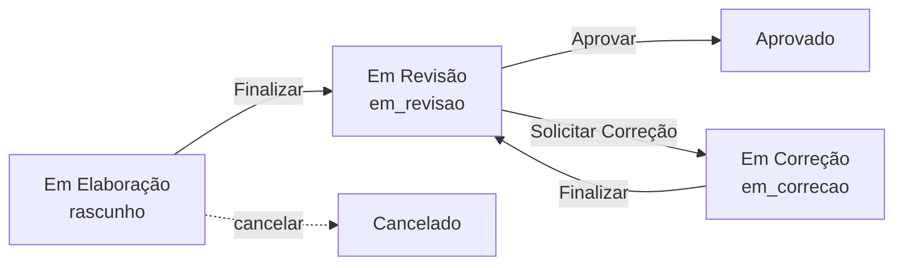

# Ticket #298 — (Bonus) Visão por Kanban

**Tipo:** Melhoria  
**Data da análise:** 2026-06-07  
**Referência visual:** [ITSM — botset-itsm](https://botset-itsm.up.railway.app/) (`D:\REPOSITORIO_GIT\itsm`)

---

## Resumo executivo

Usuários precisam acompanhar relatórios **por status em colunas**, alternando entre **Lista** (tabela atual) e **Kanban** na rota `/relatorios`, de forma similar ao quadro de tickets do ITSM.

**Situação atual:** `ReportListPage.tsx` exibe apenas tabela paginada com filtro de status. Não há toggle de visualização nem agrupamento por coluna. O projeto **já possui** `@dnd-kit/*` (usado em formulários) e matriz de permissões consolidada (#275 / #246).

**Escopo sugerido (MVP):** Kanban **somente leitura** — cards clicáveis abrem o wizard; troca de status continua pelos botões do fluxo (Finalizar, Aprovar, Solicitar Correção). Drag-and-drop de status fica **fora do MVP** (alto risco de regressão e bypass de regras).

**Veredito:** **Implementado** (2026-06-07) — Kanban read-only, toggle Lista/Kanban, `limit=100`.

---

## 1. Entendimento e contexto

### Dor do usuário

A listagem tabular dificulta a **visão do pipeline** (quantos em revisão, em correção, aprovados). Suporte e gestores querem enxergar o fluxo como no ITSM, sem perder filtros e permissões já implementados.

### Onde encaixa no sistema

| Área | Papel |
|------|--------|
| `/relatorios` | Tela principal afetada |
| `GET /api/v1/reports` | Fonte de dados (já filtra por perfil) |
| `reportPermissions.ts` | Colunas visíveis e ações por card |
| `statusLabels.ts` | Títulos das colunas |
| Dashboard | **Não alterado** (totalizadores permanecem) |

### Fluxo de status (colunas candidatas)

Ordem sugerida das colunas no quadro: **Elaboração → Correção → Revisão → Aprovado → Cancelado**.

---

## 2. Rastreabilidade de código

### Banco de dados

| Objeto | Ação |
|--------|------|
| `reports` | **Nenhuma** — status já cobre as colunas |
| Demais tabelas | **Nenhuma** |

### Backend

| Arquivo | Ação |
|---------|------|
| `api/v1/reports.py` — `list_reports` | **Reutilizar**; eventual ajuste de `limit` no kanban (hoje máx. **100**) |
| `core/report_permissions.py` | **Reutilizar** — sem mudança obrigatória no MVP |
| Novo endpoint | **Não necessário** no MVP |

### Frontend — alterar / criar

| Arquivo | Ação |
|---------|------|
| `ReportListPage.tsx` | Toggle Lista/Kanban; render condicional |
| **Novo** `ReportsKanban.tsx` | Colunas + cards (espelhar padrão ITSM) |
| **Novo** `reportsKanbanLayout.ts` | `buildKanbanColumns` / layout (adaptar de `itsm/.../kanbanBoardLayout.ts`) |
| **Novo** `useReportListingPrefs.ts` | Persistir `list` \| `kanban` no `localStorage` (adaptar `itsm/.../useListingPrefs.ts`) |
| **Novo** `ReportListViewToggle.tsx` | Dois botões: Lista \| Kanban (simplificar ITSM `ListingViewModeToggle`) |
| `statusLabels.ts` | **Reutilizar** `REPORT_STATUS_LABELS` |
| `reportPermissions.ts` | **Reutilizar** `canViewReport`, `shouldHideElaboracaoStats`, badges |
| `lib/api/reports.ts` | **Reutilizar** `reportsApi.list` |

### Referência reaproveitável (ITSM)

| ITSM | Uso no SER |
|------|------------|
| `TicketsKanban.tsx` | Layout de colunas, card, scroll horizontal |
| `kanbanBoardLayout.ts` | Agrupamento; colunas vazias empilhadas |
| `ListingViewModeToggle.tsx` | Padrão de toggle (reduzir a 2 modos) |
| `useListingPrefs.ts` | Persistência da preferência |
| `Requests.tsx` | Orquestração lista vs kanban |

**Não copiar literalmente:** drag-and-drop com `onStatusChange` — no SER as transições exigem wizard/modal (#246).

---

## 3. Análise de impacto e regressão

### O que pode quebrar ou exige re-teste

| Área | Risco | Mitigação |
|------|-------|-----------|
| Listagem tabela | Baixo | Manter componente atual intacto; só extrair ou envolver |
| Paginação | Médio | Kanban precisa **todos** os itens visíveis nas colunas — conflita com `page`/`limit=20` |
| Filtro por status | Médio | Em kanban, filtro único esconde outras colunas — definir UX |
| Permissões #275 | Alto se houver drag | MVP read-only evita bypass |
| Suporte sem `rascunho` | Médio | Ocultar coluna Elaboração (já existe `shouldHideElaboracaoStats`) |
| Performance | Médio | `list_reports` faz N+1 joins por item; kanban com `limit=100` amplifica |

### Telas para re-teste

- `/relatorios` — Lista e Kanban, todos os perfis (Técnico, Suporte, Admin)
- Wizard — abrir card do kanban (Editar/Visualizar)
- Dashboard — sem alteração, smoke test
- Exclusão na lista — ícone só em `rascunho` (kanban: decidir se mostra ação no card)

---

## 4. Lacunas e checklist de esclarecimento

| 1 | Kanban permite **arrastar** card entre colunas? | **Não** — regras de status do SER (#275/#246) |
| 2 | Toggle só **Lista \| Kanban**? | **Sim** |
| 3 | **Paginação** no kanban? | **`limit=100`**, sem paginação; aviso se `total > 100` |
| 4 | Coluna **Cancelado**? | **Sim** — última coluna do quadro |
| 5 | Filtro dropdown no modo kanban? | **Oculto** — quadro completo por status; filtro só na Lista |
| 6 | Persistir preferência (localStorage)? | **Sim** — `ser:list:relatorios:view` |

---

## 5. Segurança e performance

### Segurança

- **MVP read-only:** nenhuma nova superfície de alteração de status; permissões continuam no backend ao abrir/editar no wizard.
- **Se drag for exigido depois:** validar cada drop com `can_update_report_status` + fluxos especiais (`solicitar-correcao` com descrição, não `PUT /status` genérico).
- Dados já filtrados no backend por perfil — kanban não expõe rascunhos ao Suporte.

### Performance

- Carga única `limit=100` aceitável para MVP; monitorar volume em produção.
- Melhoria futura: endpoint `GET /reports/kanban-summary` (id, status, campos do card) ou eliminar N+1 na listagem.
- Scroll horizontal no board (padrão ITSM) — OK para 4–5 colunas.

---

## 6. Sugestão de implementação

### Fase 1 — Infra de preferência e toggle (~0,5 dia)

1. Criar `useReportListingPrefs.ts` com `viewMode: 'list' | 'kanban'`.
2. Criar `ReportListViewToggle.tsx` (ícones `Table2` + `Columns3` do lucide).
3. Em `ReportListPage`, header: toggle à direita do título / ao lado do filtro.

### Fase 2 — Layout kanban (~1 dia)

1. Criar `reportsKanbanLayout.ts` — colunas fixas a partir de `ReportStatus[]`, ordem workflow, filtrar `rascunho` se `shouldHideElaboracaoStats(user)`.
2. Criar `ReportsKanban.tsx`:
   - Props: `reports`, `user`, `onOpen(reportId)`, `onDelete?`
   - Coluna: título + contador + lista de cards
   - Card: click → `navigate(/relatorios/:id/preencher)`
   - Cores via mapa existente em `getStatusBadge`
3. **Sem** `DndContext` no MVP.

### Fase 3 — Dados (~0,5 dia)

1. Modo kanban: `useQuery` com `limit: 100`, `page: 1`, **sem** `status` no filtro (ou respeitar decisão #5).
2. Modo lista: manter query atual.
3. Se `total > 100`, banner: “Exibindo os 100 relatórios mais recentes no kanban”.

### Fase 4 — Polimento (~0,5 dia)

1. Empty state por coluna (estilo ITSM).
2. Responsivo: scroll horizontal `overflow-x-auto`.
3. Testes manuais por perfil.

**Estimativa total:** 2–2,5 dias (MVP read-only).

### Fase futura (opcional) — Drag-and-drop

1. `@dnd-kit/core` já instalado.
2. Mapa `statusDestino → handler` (Finalizar / Aprovar / POST solicitar-correcao).
3. Bloquear drop quando transição não permitida (feedback visual).

---

## 7. Critérios de aceite e testes de regressão

### Aceite funcional

- [x] Em `/relatorios`, toggle **Lista** \| **Kanban** visível e funcional.
- [x] Preferência de visualização persiste ao recarregar a página.
- [x] Kanban exibe colunas por status com labels de `statusLabels.ts`.
- [x] Cards mostram dados mínimos; clique abre wizard com permissão correta.
- [x] **Suporte:** coluna Em Elaboração **ausente**; demais colunas com relatórios permitidos.
- [x] **Técnico:** vê só seus relatórios, todas as colunas aplicáveis.
- [x] **Admin:** vê todos os relatórios.
- [x] Modo lista permanece idêntico ao atual (paginação, filtro, excluir).
- [x] Cores/badges consistentes com lista e dashboard.

### Regressão

- [ ] #275 — matriz de permissões inalterada ao abrir pelo kanban.
- [ ] #246 — Solicitar Correção / Em Correção refletidos na coluna correta.
- [ ] #244 — botão Novo Relatório só para Técnico.
- [ ] Filtro de status na **lista** continua funcionando.
- [ ] Performance aceitável com ~100 relatórios.

---

## 8. Veredito de prontidão

| Critério | Status |
|----------|--------|
| Requisito do prompt (toggle + kanban em `/relatorios`) | ✅ Claro |
| Referência ITSM mapeada | ✅ |
| Backend existente suficiente (MVP) | ✅ |
| Riscos de permissão identificados | ✅ |
| Decisões de produto (seção 4) | ✅ **Confirmadas** |
| **Pronto para desenvolvimento** | **Implementado** |

---

## Anexo — Mapa coluna × status × perfil

| Coluna | `status` | Técnico | Suporte | Admin |
|--------|----------|---------|---------|-------|
| Em Elaboração | `rascunho` | ✅ (próprios) | ❌ ocultar | ✅ |
| Em Correção | `em_correcao` | ✅ (próprios) | ✅ | ✅ |
| Em Revisão | `em_revisao` | ✅ (próprios) | ✅ | ✅ |
| Aprovado | `aprovado` | ✅ (próprios) | ✅ | ✅ |
| Cancelado | `cancelado` | ✅ (próprios) | ✅ | ✅ |
