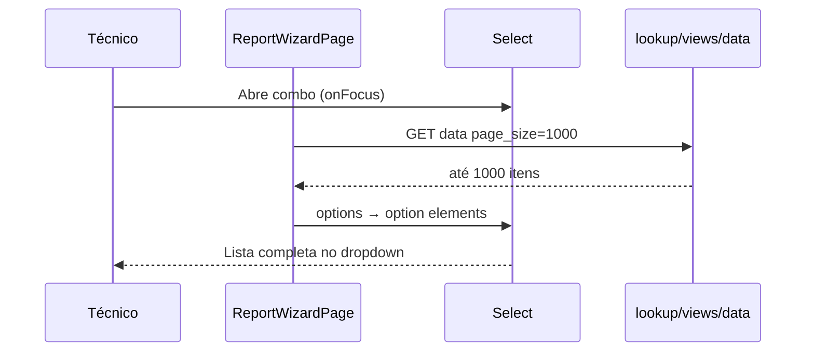

# Ticket #300 — Ampliar limite de itens no combo para 1000

**Tipo:** Melhoria  
**Data da análise:** 2026-06-07  
**Revisão:** 2026-06-07 — escopo **combo simples** (`use_autocomplete = false`), **não** autocomplete  

---

## Resumo executivo

Campos lookup configurados como **combo simples** (`<Select>`, opção **“Usar Autocomplete” desmarcada**) carregam no máximo **50 itens** da view (ex.: Cliente / `vw_tab_clientes_lookup`, ~600 registros).

**Causa raiz:** `GET /lookup/views/.../data` usa `page_size` padrão **50** (máx. era **200**); o wizard **não enviava** `page_size` na carga do combo simples.

**Fora de escopo:** modo **Autocomplete** (`use_autocomplete = true`) — outro fluxo (busca dinâmica, `maxResults`, `handleLookupSearch`).

**Resultado esperado:** combo simples lista até **1000** itens.

**Veredito:** **Implementado** (2026-06-07) — backend `le=1000` + wizard envia `page_size=1000` só quando `use_autocomplete === false`.

---

## 1. Entendimento e contexto

### Dor do usuário

No formulário **Vaso de Pressão**, campo **Cliente** (lookup, view Clientes, **sem autocomplete**), o `<select>` não mostra todos os clientes (~600+).

### Configuração real (print)

| Propriedade | Valor |
|-------------|--------|
| Tipo | Lookup |
| Origem | View → Clientes (`vw_tab_clientes_lookup`) |
| **Usar Autocomplete** | **false** → renderiza `<Select>` |

### Onde encaixa

| Modo | Componente | Escopo #300 |
|------|------------|-------------|
| `use_autocomplete === false` | `<Select>` (combo simples) | **Sim** |
| `use_autocomplete !== false` | `<Autocomplete>` | **Não** |
| `choice` | Opções estáticas no template | **Não** |

### Fluxo (combo simples)

---

## 2. Rastreabilidade de código

### Banco de dados

Nenhuma alteração.

### Backend

| Arquivo | Alteração |
|---------|-----------|
| `api/v1/lookup.py` | `page_size` máx. **50 → 1000** (`le=1000`) |

### Frontend

| Arquivo | Alteração |
|---------|-----------|
| `lib/lookup/constants.ts` | `LOOKUP_COMBO_MAX_ITEMS = 1000` |
| `ReportWizardPage.tsx` | `viewLookupRequestParams()` — envia `page_size: 1000` **apenas** se `use_autocomplete === false` |
| `ReportWizardPage.tsx` | `loadLookupOptionsForField` + reload de lookup dependente |

### Explicitamente fora de escopo

| Arquivo | Motivo |
|---------|--------|
| `autocomplete.tsx` | Modo autocomplete |
| `handleLookupSearch` | Busca dinâmica do autocomplete |
| `manut_data.py` | Telas admin NR13 |

---

## 3. Decisões de produto

| # | Decisão |
|---|---------|
| 1 | Escopo = **combo simples** (`use_autocomplete = false`) |
| 2 | Limite = **1000** itens por carga |
| 3 | Autocomplete = **fora** deste ticket |
| 4 | Listas JSON (`lookup-lists`) já retornam tudo — sem mudança |

---

## 4. Critérios de aceite

- [x] Cliente com **Usar Autocomplete = false** exibe até **1000** opções no `<Select>`.
- [x] API aceita `page_size` até **1000**.
- [x] Modo autocomplete **inalterado** (continua default 50 na API se não pedir mais).
- [ ] Cliente além da 50ª posição selecionável após deploy (validar em produção).
- [ ] Equipamento dependente do cliente continua OK.

### Regressão

- [ ] Lookup com autocomplete marcado — comportamento anterior.
- [ ] Salvar rascunho / finalizar com cliente do combo simples.

---

## 5. Veredito

| Critério | Status |
|----------|--------|
| Escopo combo simples confirmado | ✅ |
| Implementação alinhada ao escopo | ✅ |
| **Pronto / implementado** | **Sim** |

---

## Anexo — Limites

| Camada | Combo simples (antes) | Combo simples (depois) |
|--------|----------------------|------------------------|
| API `lookup.py` | default 50, máx. 200 | máx. **1000** |
| Wizard load (view) | sem `page_size` | `page_size=1000` se `use_autocomplete=false` |
| Autocomplete | `maxResults=50` | **sem alteração** |
