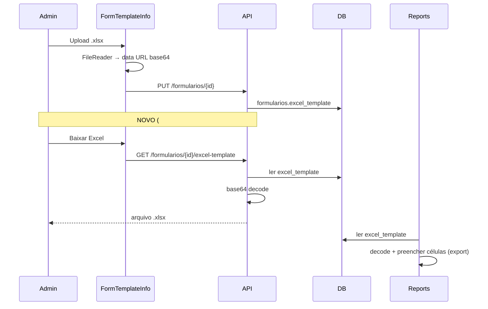

# Ticket #302 — Download do template Excel de mesclagem no formulário

**Tipo:** Melhoria  
**Data da análise:** 2026-05-18  
**Status:** ✅ Implementado (2026-05-18)  

---

## Resumo executivo

Na tela de edição do formulário (`/formularios/{id}`), o campo **“Template Excel (para mesclagem de dados)”** permite **upload** do arquivo usado na exportação de relatórios (Excel/PDF), mas **não há opção de download** do arquivo já gravado.

O administrador precisa **baixar o Excel bruto** para revisar layout, mapeamentos e eventualmente editar e fazer **novo upload**.

**Situação atual:**
- Upload/remoção funcionam em `FormTemplateInfo.tsx` (base64 via `FileReader.readAsDataURL`)
- Armazenamento em `formularios.excel_template` (MEDIUMTEXT, base64)
- Exportação de relatório **usa** esse template (`reports.py` — decode + `openpyxl`)
- Existe download de **outro** Excel: `GET /formularios/import-template` — modelo para **importar páginas/campos** (`ImportExcelModal`), **não** o template de mesclagem

**Resultado esperado:** botão para baixar o Excel de mesclagem já carregado, na seção “Informações do Formulário”.

**Veredito:** **Pronto para desenvolvimento** — escopo pequeno, código de decode já existe.

---

## 1. Entendimento e contexto

### Dor do usuário

Após configurar o template Excel de um formulário, não é possível recuperar o arquivo original pela UI. Para reavaliar fórmulas, planilhas ou células mapeadas, o admin teria que manter cópia local ou refazer o arquivo do zero.

### Onde se encaixa no sistema

| Fluxo | Papel do `excel_template` |
|-------|---------------------------|
| Edição do formulário | Upload/remoção em `FormTemplateInfo` |
| Exportação Excel do relatório | `POST/GET .../reports/{id}/export-excel` — preenche células via `excel_mapping` |
| Exportação PDF do relatório | Mesmo template, conversão posterior |
| Importação páginas/campos | **Independente** — `import-excel` + `import-template` |

### Tela alvo

[Formulário #1 em produção](https://laudonr13-frontend-prod.up.railway.app/formularios/1) — aba/seção **Informações do Formulário** (`FormTemplateEditPage` → `FormTemplateInfo`).

---

## 2. Rastreabilidade de código

### Banco de dados

| Tabela | Coluna | Tipo | Observação |
|--------|--------|------|------------|
| `formularios` | `excel_template` | MEDIUMTEXT (base64) | Migration 004/005/007; até ~16MB |

**Nenhuma migração necessária** para o download. Opcional futuro: coluna `excel_template_filename` (nome original) — **não existe hoje**.

### Backend — alterar / criar

| Arquivo | Ação |
|---------|------|
| `api/v1/formularios.py` | Novo endpoint `GET /formularios/{id}/excel-template` → `StreamingResponse` |
| `services/excel_template.py` (sugerido) | Extrair decode base64 reutilizável (hoje duplicado em `reports.py`) |
| `api/v1/reports.py` | (Opcional) Reutilizar helper de decode — reduz duplicação |

**Endpoint sugerido:**

```python
@router.get("/{formulario_id}/excel-template")
async def download_excel_template(
    formulario_id: int,
    current_user: User = Depends(require_admin),
    session: Session = Depends(get_session),
):
    # 404 se formulário não existe
    # 404 se excel_template vazio
    # decode base64 (remover prefixo data:...;base64,)
    # Content-Disposition: attachment; filename="template-{slug}-{id}.xlsx"
```

**Ordem de rotas:** registrar **antes** de rotas genéricas conflitantes; path `/excel-template` é distinto de `/{id}`.

**Permissão:** `require_admin` — alinhado ao `PUT` que grava o template e à rota `formularios/:id` (Admin).

### Frontend — alterar

| Arquivo | Ação |
|---------|------|
| `lib/api/formularios.ts` | `downloadExcelTemplate(id): Promise<Blob>` |
| `components/FormTemplate/FormTemplateInfo.tsx` | Botão **“Baixar Excel”** quando há template |
| `lib/download.ts` (sugerido) | Helper `triggerBlobDownload(blob, filename)` — padrão já usado em `FormTemplateEditPage` (export JSON) |

### Reaproveitamento existente

| Recurso | Uso no #302 |
|---------|-------------|
| `formulariosApi.downloadImportTemplate()` | Padrão de download blob + `responseType: 'blob'` |
| Decode em `reports.py` (linhas ~808–819) | Mesma lógica para obter bytes do Excel |
| `StreamingResponse` em `download_import_template` | Padrão de resposta HTTP |
| UI verde “✓ Arquivo Excel anexado” | Onde inserir o botão (modo leitura e edição) |

### Fora de escopo

- Alterar formato de armazenamento (S3, arquivo em disco)
- Download na listagem `/formularios` (só na edição)
- Versionamento/histórico de templates
- Renomear ou substituir `import-template` (continua sendo modelo de importação de campos)

---

## 3. Análise de impacto e regressão

### Riscos

| Risco | Mitigação |
|-------|-----------|
| Confundir com “Baixar Modelo Excel” do `ImportExcelModal` | Label claro: **“Baixar template de mesclagem”** ou **“Baixar Excel carregado”** |
| Arquivo grande (até 10MB upload) | Stream via `BytesIO`; limite já validado no upload |
| Base64 inválido/corrompido | 500 com mensagem clara; mesmo tratamento de `export-excel` |
| Nome do arquivo desconhecido | Gerar `template-mesclagem-{nome-form}-{id}.xlsx` |
| `.xls` legado vs `.xlsx` | Inferir extensão do prefixo `data:application/...` do data URL, default `.xlsx` |
| Listagem retorna `excel_template` inteiro no JSON | Pré-existente; fora do escopo (otimização futura: omitir na list) |

### Re-teste obrigatório

- Upload novo Excel → Salvar → Download → arquivo abre no Excel
- Download com template ausente → botão oculto ou 404 tratado
- Remover template → botão some
- Exportação Excel/PDF de relatório (mesmo template)
- “Baixar Modelo Excel” no modal de importação (não regrediu)
- Apenas Admin acessa download (Suporte/Técnico → 403)

---

## 4. Lacunas e checklist de esclarecimento

| # | Pergunta | Recomendação |
|---|----------|--------------|
| 1 | Download só em modo leitura ou também em edição? | **Ambos** — útil baixar antes de substituir |
| 2 | Endpoint backend ou decode só no frontend? | **Endpoint backend** — consistente, não depende do JSON já carregado, facilita arquivos grandes |
| 3 | Guardar nome original do arquivo? | **Opcional** — fase 2; fase 1 usa nome gerado |
| 4 | Botão desabilitado sem template? | **Ocultar** botão quando `!excel_template` |
| 5 | Incluir `excel_template` no export JSON do formulário? | Já incluído — download é complementar para uso humano no Excel |

---

## 5. Segurança e performance

- **Segurança:** `require_admin`; sem exposição de path arbitrário; bytes vêm só do registro do formulário.
- **Performance:** decode sob demanda no download; aceitável para admin ocasional. Evitar logar base64.
- **Vulnerabilidade:** nenhuma nova superfície relevante além do que já existe no `GET /formularios/{id}` (retorna base64 completo hoje).

---

## 6. Sugestão de implementação

### Fase 1 — Backend (~1h)

1. Criar `decode_excel_template(base64_str: str) -> bytes` (extrair de `reports.py`).
2. Adicionar `GET /formularios/{formulario_id}/excel-template`:
   - `require_admin`
   - 404 se sem template
   - `StreamingResponse` com `application/vnd.openxmlformats-officedocument.spreadsheetml.sheet`
   - `Content-Disposition` com nome sanitizado do formulário

### Fase 2 — Frontend (~1h)

1. `formulariosApi.downloadExcelTemplate(id)` — `responseType: 'blob'`.
2. Em `FormTemplateInfo.tsx`:
   - Modo **leitura**: ao lado de “✓ Arquivo Excel anexado”, botão **Baixar Excel**.
   - Modo **edição**: na caixa verde do arquivo anexado, botão **Baixar** antes de **Remover**.
3. Handler: blob → `URL.createObjectURL` → click → revoke (igual export JSON).

### Fase 3 — Refino opcional (~30min)

- Helper compartilhado de download
- Refatorar `reports.py` para usar `decode_excel_template`

**Estimativa total:** 0,5–1 dia.

---

## 7. Critérios de aceite

### Funcional

- [ ] Na tela `/formularios/{id}`, com template carregado, botão visível para download.
- [ ] Arquivo baixado abre no Excel/LibreOffice sem corrupção.
- [ ] Conteúdo corresponde ao último upload (Excel “bruto”, sem mesclagem de dados do relatório).
- [ ] Sem template: botão não aparece (ou mensagem adequada).
- [ ] Após novo upload e salvar, download reflete o arquivo novo.

### UX

- [ ] Label distingue do “Baixar Modelo Excel” (importação de campos).
- [ ] Feedback de loading durante download (“Baixando...”).

### Regressão

- [ ] Upload e remoção do template continuam funcionando.
- [ ] Exportação Excel/PDF de relatórios inalterada.
- [ ] Importação de páginas/campos via Excel inalterada.

---

## 8. Veredito de prontidão

| Critério | Status |
|----------|--------|
| Requisitos do prompt | ✅ |
| Armazenamento mapeado (`formularios.excel_template`) | ✅ |
| Lógica de decode existente (`reports.py`) | ✅ |
| Padrão de download existente (`import-template`) | ✅ |
| Lacuna de nome original | ⚠️ Não bloqueante |
| **Pronto para desenvolvimento** | **Sim** |

---

## Anexo — Fluxo de dados do template


